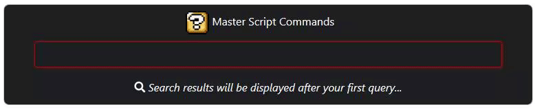

# MasterScriptCommands

A gui command box styled using G33kdude's Neutron Class  
  
This is v1, modified & forked originally from [plul's AutoHotkey Launcher ](https://github.com/plul/Public-AutoHotKey-Scripts).

## What's changed from v1 aka Master Search Box?

- Utilizes G33kdude's neutron class to add JS, Html, & CSS for gui
- Use Elasticlunr js search engine which is superior to Sift's function
- Added quick access to run a AHK Command from MSC edit field.  
  
- Overall easier to beautify the gui using CSS

## Dependencies

- [Neutron](https://github.com/G33kDude/Neutron.ahk)

## Known v2 Bugs

- may encounter at start of script a JS error
  - _I believe it could just be the IE window being created sometimes has a error, but it doesn't effect the script currently from my tests_

## Master Search Box v2 aka Master Script Commands
